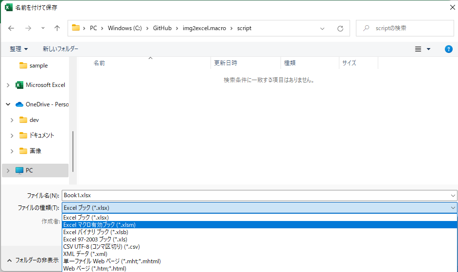
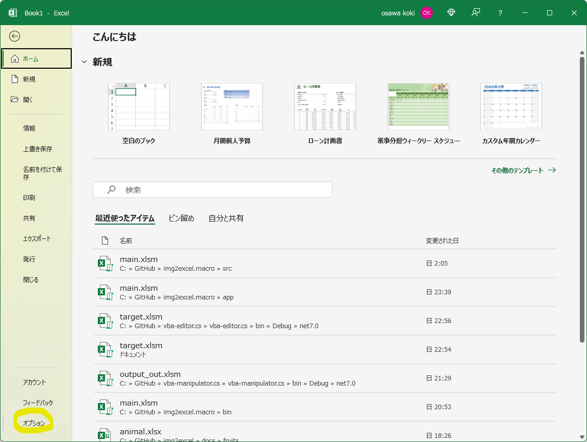
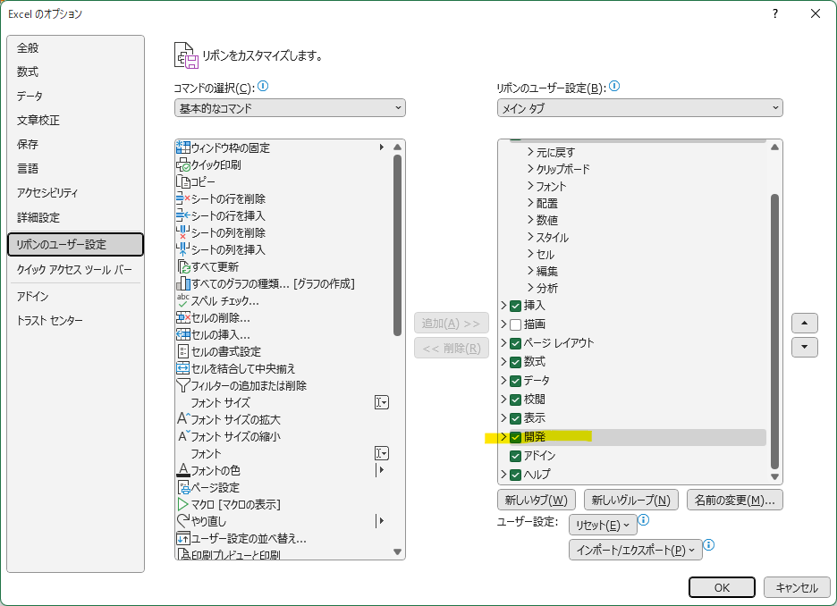
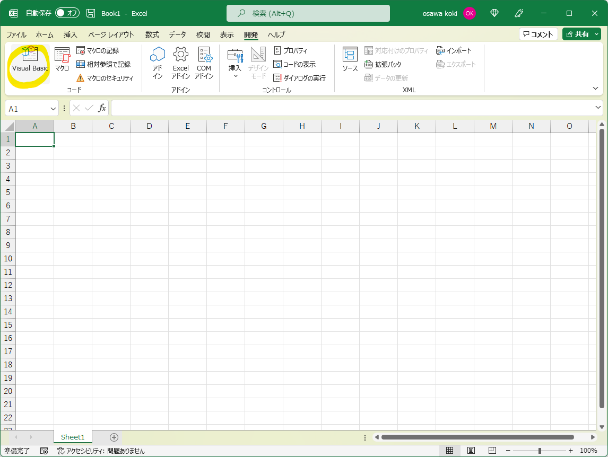
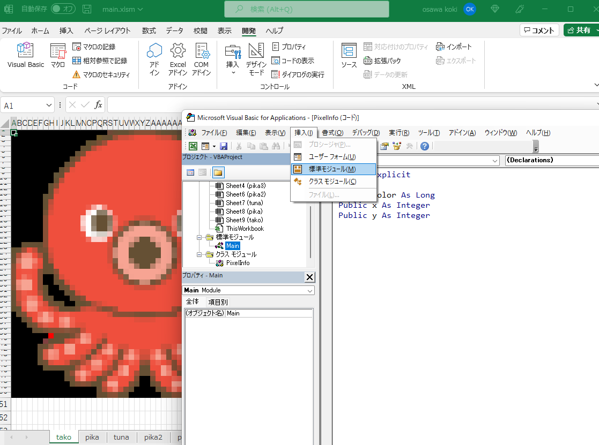

# img2excel.macro

Excelマクロ(VBA)を使用して画像ファイルを読み込み、セルを着色します。  

  

## 環境構築

### ファイルの作成

マクロ付きExcelブックとして保存します。  

  

### マクロ開発機能の有効化

「ファイル」-「オプション」-「リボンのユーザー設定」から開発チェックボックスにチェックを入れます。  

  
  

### VBEの起動

メニューの開発タブを選択し、「Visual Basic」ボタンをクリックします。  

  

### マクロファイルの作成

「挿入タブ」からマクロファイルを作成します。  
今回は標準モジュールとクラスモジュールの2つを使用します。  

  

### オブジェクト名の変更

オブジェクト名は左下のオブジェクトタグのオブジェクト名から変更できます。  
マクロのエントリポイントはサブプロシージャ名が該当し、ここを変更すればよいため、特に変更する必要はありません。  
PixelInfoクラスを記述するクラスモジュールのオブジェクト名を変更します。  

### デバグ用情報

「表示」-「イミディエイトウィンドウ」から簡単なコンソールを表示できます。  
「Debug.Print」関数の引数に渡した値が表示されます。  

緑色の矢印ボタンから実行することができます。  

## その他

- [Excelの購入(MS公式サイト)](https://www.microsoft.com/ja-jp/microsoft-365)  

## 参考文献

- [今すぐ使えるかんたん Excelマクロ＆VBA](https://gihyo.jp/book/2019/978-4-297-10241-8)  
